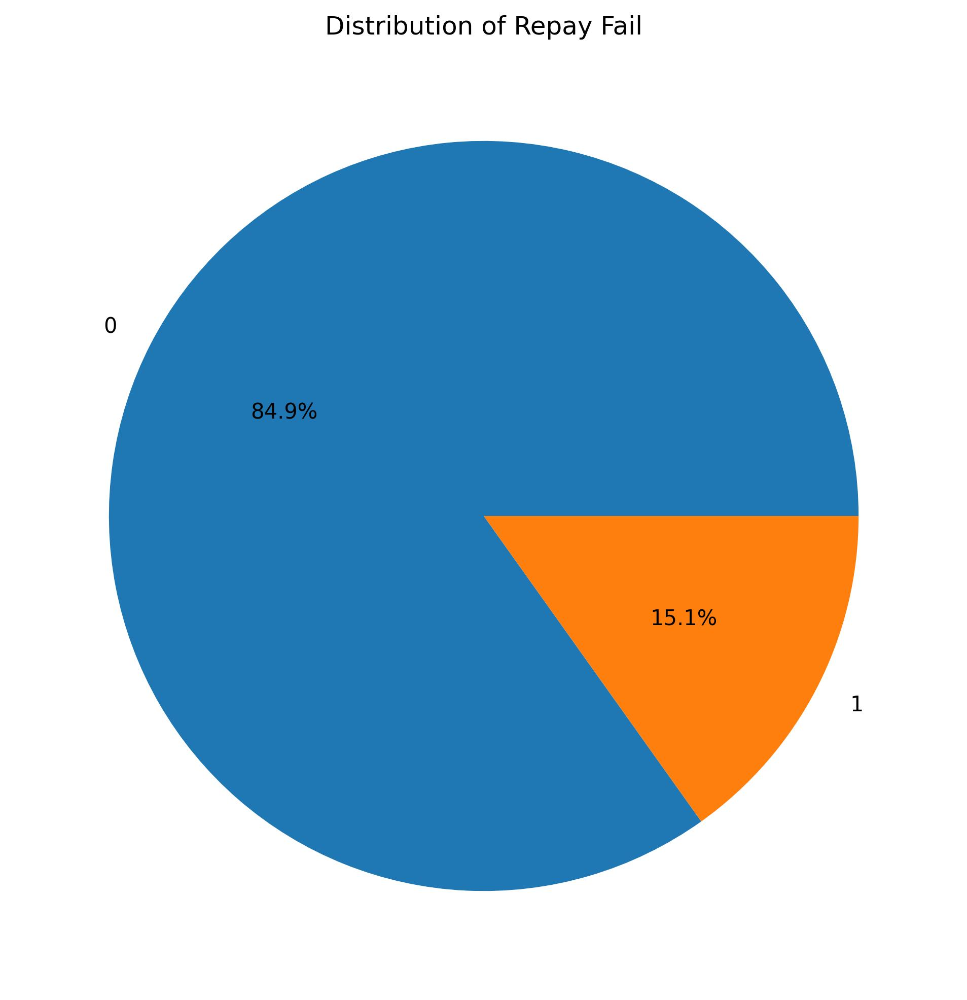
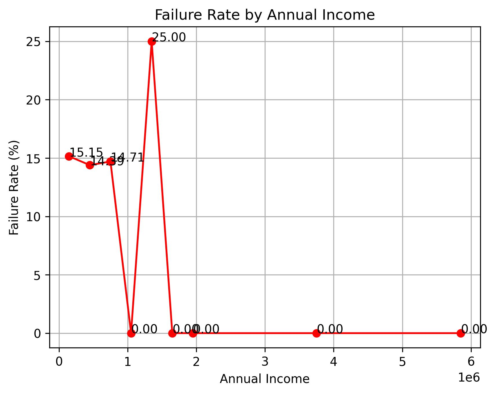
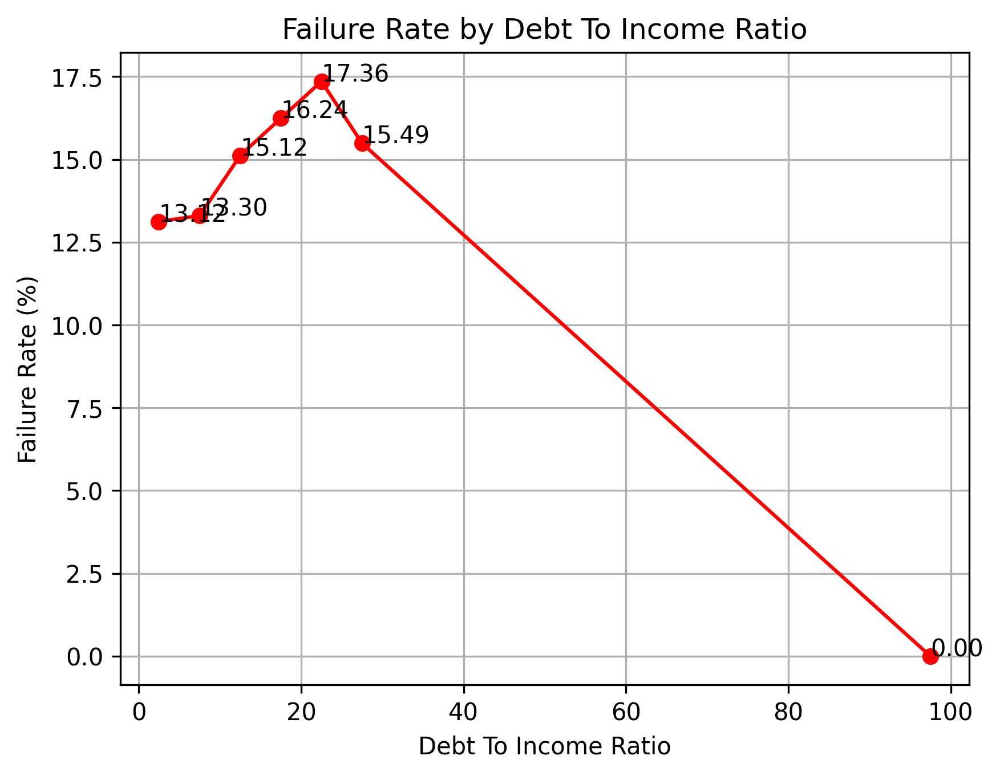
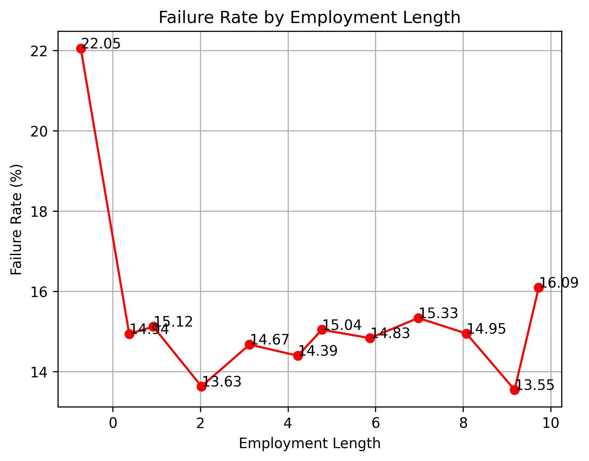
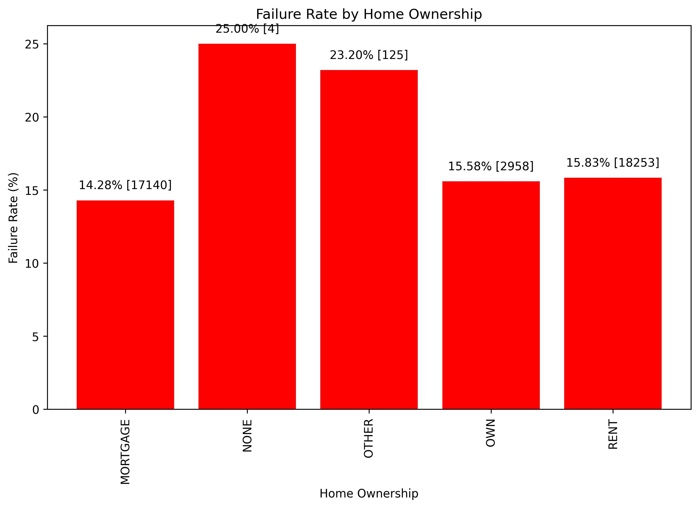
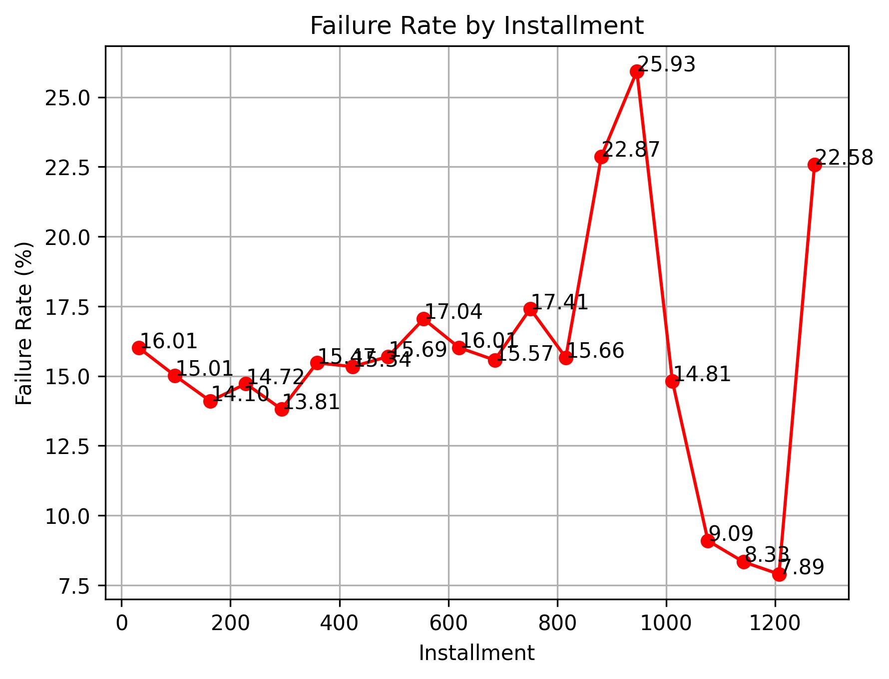
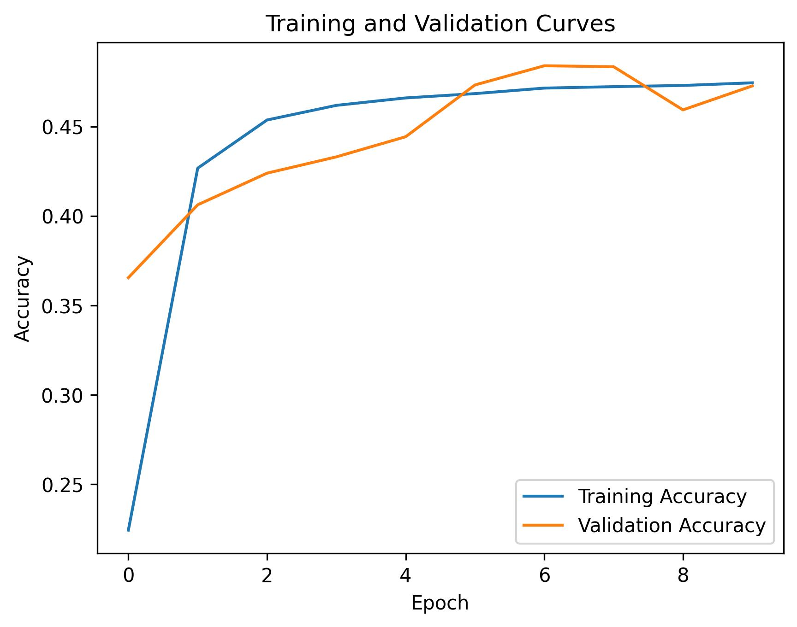
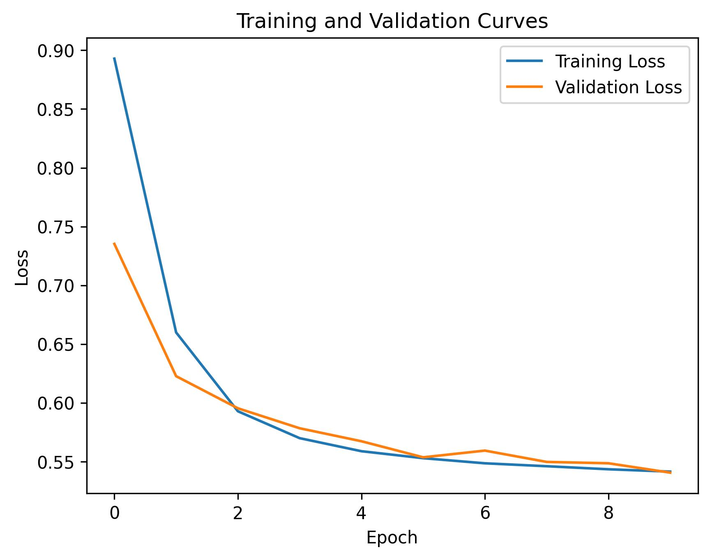

# Loan Repayment Failure Prediction using AI/ML Models
## 1.0 Introduction

This project aims to develop an AI/ML model that can predict whether existing borrowers will fail to repay their loans. The model will be trained on a historical dataset of borrowers, their features/characteristics, and whether they've failed to repay their loan.

## 2.0 Dataset Analysis
### 2.1 Initial Data Inspection

The provided dataset contains a whooping 38,480 total number of unique rows and 36 columns. The target variable is `repay_fail`, which indicates whether the borrower failed to repay the loan.

### 2.2 Exploratory Data Analysis (EDA)
EDA was conducted to understand the relationships between the features and the target variable.
As the target variable is the `repay_fail`, repayment failure rate will be used to measure how bad the given situations are.
The repayment Failure rate is calculated during data binning as
```python
temp_df = temp_df.groupby(column_for_x_axis, observed=True)['failure_rate'].mean().reset_index()
```
Before the code executes this code, the `failure_rate`'s value are equals to the `repay_fail` column. 
Note that the mean function is used. 
In a string of 0's and 1's, the percentage of 1's is the same as the mean.

Example, if we have a column with values [0, 0, 1, 1, 0, 1], 
the mean of this column would be **(0 + 0 + 1 + 1 + 0 + 1) /6 = 0.5**, which is equivalent to a repayment failure rate of where **3/6 = 0.5**.

This method is used to have more understanding on the probability to fail the repayment given a case.
For example, later in the analysis, it was known that failure rate of a person if owns a home, is about 15.58%.
The higher failure rate, the more probable for it to fail repayment.

The following insights were gained:

#### 2.2.1 Loan Repayment Failure
The target variable `repay_fail` has 2 distinct values, 1 for failure and 0 for success. 
Unfortunately, the distribution are highly imbalanced. 



About 5,829 out of 38,480 (15.15%) of the dataset are under failure class. 
These may pose difficulties during AI training. 
However, several steps are made to handle these types of situations. 
Additionaly, low populations of failure may indicate that the company's 
current policy for applying a loan has an effective approval requirements.

#### 2.2.2 Failure Rate by Annual Income



The figure shows the relationship failure rate and the annual income. 
The data binning of 20 bins had been performed. 

This generally shows that income and repayment failure have a low inverse correlations. 
As income increases, repayment failure rate decreases. 
The failure rate drops to 0% as annual income reached about 1,000,000. 
Unfortunately, there is a sudden spike on failure rate at around 1,250,000 annual income. 
This may be an outlier where borrower's might be overly confident with their ability to repay the loan. 
Borrower's earning above this level seems to have no repayment failure.

### 2.2.3 Failure rate by Debt to Income Ratio



The figure shows the relationship failure rate and the debt to income ratio. 
The data binning of 20 bins had been performed. 

Straight of the bat, an outlier is visible at about 95% debt to income ratio. 
Having a debt of 95 times the income with zero failure repayment is not logically sound. 
Ignoring the outlier, the relationship between Failure rate and the debt to income ratio has a positive correlation. 
The higher the debt to income ration, the higher the failure rate. 
In layman terms, the less the debt, the less probable to fail the repayment. 
This aligns to our common sense.

### 2.2.4 Failure rate by Employment Length



The figure shows the relationship failure rate and the Employment rate. 
For this analysis, the data preprocessing function was repurpose for generating line graph. 
The value employment length = 0 was filtered out because value 0 indicate Null value.

Generally, the line graph indicate a low positive relationship between employment length and the failure rate. 
The failure fluctuate between 13% to 16% of failure rate. 
The increases in failure rate may due to increase in debt, loan, and or commitments.

### 2.2.5 Failure rate by Home Ownership



This figure shows the failure rates between different home ownerships. 
This may be counter-intuitive, but the data shows that does not own a home hav ethe highest failure rate despite being 1 less monthly commitments compared to other populations. Owning a home, rent, or mortgage it varies in failure rates between 14% to 16%. Other type of ownership (this includes unkown types) has as high as 23% failure rate, just below None ownership.
These might suggest that people with no ownership of a home, is a person who does not have enough income to live in a home.
Hence, the high failure rate.

### 2.2.6 Failure rate by Installments



This figure shows the failure rates across the monthly installments.
Unlike any other, the monthly installment may not have any relationship with the failure to repay. 
The failure rate does fluctuate around 16%, ranging from 7.89% to 25.93%. 
Common sense dictates that the higher the installment, the more probable to fail repayments. 
However, The current requirements enforced by the financial institutions to approve a loan may result to a steady repayment ability to installment ratio. 
However, Installments at the higher end may be unpredictable it starts to fluctuate on a very high variance.

### 2.2.7 Summary

From the above analysis, we can conclude that:
- Failure of repayment is a rare case.
- Higher income does help prevent failure to repay, but there are inbetween where they might be overly confident to be able to repay and taking larger risk in applying a loan.
- Higher the debt, the more likely to fail repayment.
- The longer you work, does not necessarily mean you are more capable of repaying the loan.
- Be careful to apply a loan if you don't have any type of owning a home.
- Monthly installments may not be the factor of failure repayment 

### 2.3 Data Preprocessing

Before begin to train the AI models, data preprocessing needs to be done. In this project, 5 main data processing steps had be done.

- Feature Extraction
- Transformation
- Handling Missing Value
- Normalisation
- Remove Irrelevant Column

#### 2.3.1 Feature Extraction

The list of generated column are as below, along with their decriptions

| Feature Name                        | Extraction Column             | Values                                                                 | Reason of Extraction                                                             |
|:------------------------------------|:------------------------------|:-----------------------------------------------------------------------|:---------------------------------------------------------------------------------|
| meet_credit_policy                  | loan_status                   | 1: meets policy<br>0.5: ambiguous<br>0: does not meet                  | loan_status column contains additional data about the meeting the credit policy. |
| purpose_asset_type                  | purpose                       | 1: Assets<br>0.5: Ambiguous<br>0: Expenses                             | purpose column can be categorized in multiple ways                               |
| purpose_essential                   | purpose                       | 1: essential spending<br>0.5: Ambiguous<br>0: nonessential             | purpose column can be categorized in multiple ways                               |
| exist_months_since_last_delinquency | months_since_last_delinquency | 1: existence of last delinquency<br>0.5: unknown<br>0: no delinquency  | Handling null values in months_since_last_delinquency column                     |

Below is an example code snipet for the following feature extraction.
``` python
def extract_meet_credit_policy(loan_status):
    """
        - 1 represents 'meet the credit policy'
        - 0.5 represents ambiguous, unknown or not sure.
        - 0 represents 'does not meet the credit policy'
    """
    try:
        loan_status = loan_status.lower()
        if "does not meet the credit policy" in loan_status:
            return 0
        else:
            return 1
    except:
        return 0.5
```

#### 2.3.2 Transformation

##### 2.3.2.1 Transform Categorical Numeric Data into Numerical Data

For this transformation, it converts the categorical data into numerical data where possible. 
The "Categorical Numeric Data" refers to numeric scale that was stored as a categorical values.
For example, the 'term' column is a categorical data that has 2 values, "36 months" and "60 months". 
All letters and symbols will be removed. 
Hence, the "36 months" will transformed into "36".
This method is future-proof where it is ready for any new term, which will somehow be implemented, such as "84 months", will be able to be process without errors.

With some form of variations to handle each column's different needs, this kind of transformation will be applied to the following column:
- term
- employment_length
- revolving_utillization

Below is an example code snipet for the following transformation.
``` python
def transform_revolving_utillization(text):
    try:
        new_text = "".join([s for s in text.lower() if s == "." or s.isdigit()])
        return float(new_text)
    except:
        return 0
```

##### 2.3.2.2 Transform Non-Ordinal Categorical data into Numerical Data

For this transformation, it converts Ordinal data into numerical data using various methods. 
The "Non-Ordinal Categorical data" refers to categorical data that has no clear linear order.
For example, the 'home_ownership' column is a categorical data that has multiple values, such as "own", "rent", "mortgage", "other" and "none". 
Another extreme example is the "purpose" column. the values are vast and seems to be have a multi-dimensional relationship.
Ranging from "car" to "home_improvement", "educational" to "small_business", and "major_purchase" to "debt_consolidation".
These have no clear linear logical order. The "home_ownership" can be ordered in terms of how wealthy the person is.
If we were to sort them from "None" to "Own", the "Mortgage" and "Other" doesn't seems to fit.

Sorting them in terms of risk allows the model to understand the categorical data in a numerical format.
Each category is assigned a numerical value based on its failure rate, which was calculated in the data analysis phase.
These method is much like vectoring the categories into a their own unique vectors, then decreased the dimensionality into 1 dimension that is important to predict the failure repayment, which is the risk dimension. 

With some form of variations to handle each column's different needs, this kind of transformation will be applied to the following column:
- home_ownership 
- verification_status 
- purpose

Below is an example code snipet for the following transformation.
``` python
def transform_home_ownership(text):
    # The values where set based on failure rate that was calculated within 01_data_analysis.py
    dict = {"own" : 15.58,
            "rent" : 15.83,
            "mortgage" : 14.28,
            "other" : 23.20,
            "none" : 25.00}
    if text.lower() in dict.keys():
        return dict[text.lower()]
    else:
        # any other value will set to as "other" home ownership
        return 23.20
```

##### 2.3.2.3 Transform Date Data into Numerical Data

For this transformation, it converts date data into numerical data using the timestamp method.
The purpose of this is to allows the model to understand the relation of a date. 
The model will understood that "12 Jan 2024" is further forward than "6 May 2022" much like the number 500 is further away from 200. 

These transformation were applied on all date type columns such as the following:
- issue_date
- earliest_credit_line
- last_payment_date
- next_payment_date
- last_credit_pull_date

Below is an example code snipet for the following transformation.
``` python
def transform_date(date_text):
    try:
        return date_text.timestamp()
    except:
        return 0
```

However, all these column were removed at the final stage before training the model. 
These may not be relevant as the question of 'when' did the person pay or 'when' is the issue date and other, may not effect the failure repayment.

Furthermore, including date data in the model may not be relevant for future predictions, as the model would need to account for temporal trends and seasonality, which could add unnecessary complexity. 
By removing these columns, we can focus on the underlying relationships between the borrower's characteristics and loan features, and build a more robust and generalizable model.

##### 2.3.2.4 Transform Zip Code Data into Numerical Data

For this transformation, it converts zip code data into numerical data by extracting the first three digits of the zip code. 
zipcode usually not being used for prediction task.
However, each region consist of different types of populations with variety of portions.
Hence, the data may be relevant in predicting the repayment failure.

Additionally, zipcodes can be sorted as a numerical scale.
Generally, zipcode of 43100 is nearby to zipcode 43100 physically.
Hence, the 'zip_code' column is converted into a numerical value.

Below is an example snipet for the following transformation.
``` python
def transform_zip_code(zip_code):
    try:
        new_zip_code = str(zip_code)[:3]
        return float(new_zip_code)
    except:
        return 0
```

##### 2.3.2.5 Transform Address State Data into Numerical Data

For this transformation, it converts address state data into numerical data using a base 26 conversion method. 
Address state such as "AL" will be treated as a base 24 digit.
The symbol A represents the value 1, B represents 2, C represents 3, and so on.
This type of transformation converts these 'base 24' digit into base 10 digit.
Do note that base 10 digits are the ones we are using daily.

The limitation of this method is the lack of relations between the transformed values.
Unlike converting zipcode, the address state does not represent any physical relation to one another.
For example, address code "KJ" does not sit next to "KK".
The 'address_state' column is converted into a numerical value, solely to be able to be process further.
Zipcodes may have more correlations than address state.

Below is an example code snipet for the following transformation:
``` python
def transform_address_state(state):
    try:
        state = str(state).upper()
        base26_value = 0
        for char in state:
            # in ASCII, A is 65, B is 66, C is 67 ...
            # the "ord(char) - 64" returns the position of the char
            base26_value = base26_value * 26 + ord(char) - 64
        # value '0' will be reserved for unknown, absent value, etc. hence, address state of "A" is 1 instead of 0.
        base26_value += 1
        return base26_value
    except:
        return 0
```

#### 2.3.3 Handling Missing Value

##### 2.3.3.1 Handling Missing Value in Numeric data

Generally, all numeric values that will not make sense to have a negative number will be assign to -1. This value will represent unkown.
This method applies to columns including, but not limited to:
- loan_amount
- funded_amount
- funded_amount_investors
- interest_rate
- installment
- annual_income
- no_delinquency_2yrs
- no_open_accounts
- public_records

Below is an example code snipet for the following method:
``` python
def transform_nan_num(value):
    try:
        if not math.isnan(float(value)):
            return float(value)
        else:
            return -1
    except:
        return -1
```

##### 2.3.3.2 Handling Missing Value in Categorical Data

Categorical data that have a defined "other" categories such as "home_ownership" column will be use as an assignment for missing values.
This is due to the unknown nature of the category "other" where the unknown value dimmed fit for the description.

With some form of variations to handle each column's different needs, this kind of handling missing values will be applied to the following column:
- home_ownership : Missing values will be treated as "other"
- verification_status : Missing values will be treated as "Not Verified"
- purpose : Missing values will be treated as "other"

Below is an example code snipet for the following method.
``` python
def transform_home_ownership(text):
    # The values where set based on failure rate that was calculated within 01_data_analysis.py
    dict = {"own" : 15.58,
            "rent" : 15.83,
            "mortgage" : 14.28,
            "other" : 23.20,
            "none" : 25.00}
    if text.lower() in dict.keys():
        return dict[text.lower()]
    else:
        # any other value will set to as "other" home ownership
        return 23.20
```

#### 2.3.4 Normalisation

After feature extraction, transformation, and handling missing data, all values in all column are now in numeric values.
The variety of range of each columns are vast. 
Some reaches 6,000,000 some are negative numbers. 
Normalizing the values into a (-1,1) range is used on all columns.

Below is an example code snipet for the following normalisation.
``` python
def transform_home_ownership(text):
    # The values where set based on failure rate that was calculated within 01_data_analysis.py
    dict = {"own" : 15.58,
            "rent" : 15.83,
            "mortgage" : 14.28,
            "other" : 23.20,
            "none" : 25.00}
    if text.lower() in dict.keys():
        return dict[text.lower()]
    else:
        # any other value will set to as "other" home ownership
        return 23.20
```

#### 2.3.5 Remove Irrelevant Column

There are several columns that are irrelevant and are removed before AI Training process. 
The list of columns to remove were not specified. 
However, the list of columns to use in training the Models are specified under [config/config.yaml](config/config.yaml).

| Column name      | Reason for Removal                                                                                                                               |
|------------------|--------------------------------------------------------------------------------------------------------------------------------------------------|
| Unnamed: 0       | irrelevant id/indexing values                                                                                                                    |
| member_id        | irrelevant id/indexing values                                                                                                                    |
| id               | irrelevant id/indexing values                                                                                                                    |
| loan_status      | loan status may include information after it was known to have failed repayment. Moreover, each categories consist of a single repay_fail class. |
| all date columns | as mentioned, all date data are irrelevant.                                                                                                      |


### 2.4 Correlation Of Features With Repayment Failure

After data preprosessing, the correlation between columns to the target variable is calculated by using the `df.corr()` function.

| No. | Preprocessed Column                 | Strength Of Correlation with repay_fail column |
|-----|-------------------------------------|------------------------------------------------|
| 1   | loan_status                         | 0.996121                                       |
| 2   | total_received_principal            | 0.343545                                       |
| 3   | total_payment                       | 0.247532                                       |
| 4   | total_payment_investors             | 0.245041                                       |
| 5   | last_payment_date                   | 0.224867                                       |
| 6   | last_payment_amnt                   | 0.220326                                       |
| 7   | interest_rate                       | 0.199220                                       |
| 8   | term                                | 0.134424                                       |
| 9   | inquiries_last_6mths                | 0.111648                                       |
| 10  | purpose                             | 0.099498                                       |
| 11  | meet_credit_policy                  | 0.093053                                       |
| 12  | public_records                      | 0.050923                                       |
| 13  | purpose_essential                   | 0.047439                                       |
| 14  | next_payment_date                   | 0.045375                                       |
| 15  | last_credit_pull_date               | 0.042871                                       |
| 16  | loan_amount                         | 0.042267                                       |
| 17  | debt_to_income_ratio                | 0.042096                                       |
| 18  | funded_amount                       | 0.039321                                       |
| 19  | annual_income                       | 0.038009                                       |
| 20  | exist_months_since_last_delinquency | 0.036929                                       |
| 21  | purpose_asset_type                  | 0.034624                                       |
| 22  | verification_status                 | 0.031944                                       |
| 23  | home_ownership                      | 0.024818                                       |
| 24  | issue_date                          | 0.023815                                       |
| 25  | months_since_last_delinquency       | 0.022288                                       |
| 26  | address_state                       | 0.020875                                       |
| 27  | no_total_account                    | 0.020672                                       |
| 28  | installment                         | 0.020620                                       |
| 29  | no_delinquency_2yrs                 | 0.020505                                       |
| 30  | zip_code                            | 0.019506                                       |
| 31  | revolving_balance                   | 0.018877                                       |
| 32  | total_received_interest             | 0.017384                                       |
| 33  | earliest_credit_line                | 0.016971                                       |
| 34  | Unnamed: 0                          | 0.014215                                       |
| 35  | member_id                           | 0.011849                                       |
| 36  | funded_amount_investors             | 0.009565                                       |
| 37  | id                                  | 0.008377                                       |
| 38  | no_open_accounts                    | 0.006294                                       |
| 39  | employment_length                   | 0.004179                                       |
| 40  | revolving_utillization              | 0.002034                                       |

From the data above, It seems that `loan_status` is the only column that have the strong correlation with the `repay_fail` column. 
However, as mentioned in "**2.3.5 Remove Irrelevant Column**", the column is expected to be available and labeled after failure to repay occurs.

Aside from `loan_status` column, the `total_received_principal`, `total_payment`, `total_payment_investors`, and `last_payment_amnt` is the
top 4 most correlated columns to failure of repayment, with correlations ranging from 0.343545 to 0.247532. 
These columns are all related to the amount of money, either received or paid, which suggests
that the ability to repay loans is closely tied to the borrower's financial situation.

It's interesting to note that the `interest_rate` column, which one might expect to be highly correlated 
with repayment failure, has a relatively moderate correlation of 0.199220, seconded by the borrower's financial situation. 
This could suggest that the interest rate is not the primary driver, but the secondary driver of repayment failure.

On the lower end, the columns `funded_amount_investors`, `no_open_accounts`, `employment_length`, and `revolving_utillization` 
have much weaker correlations with repayment failure than expected. 
Surprisingly, they have an even lower correlations than the seemingly irrelevant columns `member_id`, `id`, and `Unnamed: 0`. 
After these 4 columns where removed, The models where able to improve in terms of accuracy and sensitivity.

## 3.0 Train Test Data Splitting

The dataset is split into 80:20. The 80% of the dataset is used as the training dataset, while the other 20% is used for testing dataset.
It is ideal to preserve the class distribution of the repayment failure (`repay_fail`) in both the training and testing datasets to ensure that the model is trained and evaluated on a representative sample of the data.
However, the class distribution for this case is highly imbalance. 
Therefor, the training data is trimmed (remove extra `repay_fail = 0` data) to match the number of `repay_fail = 1`.
The extra `repay_fail = 0` from the training data was not put into the testing dataset to preserve real-world scenario.

The `prepare_train_test_data` function is used to split the dataset into training and testing datasets. The function first separates the data into two groups based on the `repay_fail` column: one group with `repay_fail` equal to 0 (pass) and another group with `repay_fail` equal to 1 (fail). The data is then randomized to ensure that the order of the samples does not affect the training process.

The training dataset is created by taking the first 80% of the samples from each group, and the testing dataset is created by taking the remaining 20% of the samples from each group. The resulting training and testing datasets are saved as CSV files.

The training and testing dataset are as below:

| Class \ Dataset | Training Dataset | Testing Dataset |
|-----------------|------------------|-----------------|
| repay_fail = 0  | 4,663 (50.00%)   | 6,531 (84.85%)  |
| repay_fail = 1  | 4,663 (50.00%)   | 1,166 (15.15%)  |

### 3.1 How to Initiate Data Preprocessing and Train Test Data Splitting

To initiate data preprocessing and train test data splitting process, simply run the [02_data_preparation.py](02_data_preparation.py) file.
Note that some Randomness still exist in Data precessing despite several measures had been done to prevent randomness.
Generating new training data will result in different AI Model performance.

## 4.0 AI Training and Testing

In this project, 2 AI/ML algorithms were used to develop the model.
- Artificial Neural Network (ANN)
- K-Nearest Neighbors (K-NN)

These 2 distinct algorithm is chosen due their key differences.

1.  Simplicity vs Complexity
   - The 2 algorithm have different complexity levels. 
      K-NN is way more simple than ANN, which ANN has much more parameters to do fine-tuning.
   - The difficulty to develop a K-NN model is impervious to complex problems due to how it works. Unlike ANN, a lot of parameter needs to be fine-tuned to be able to performed on much more complex problems.
2. Lightweight vs Heavy duty
   - The 2 algorithm have different performance requirements. ANN's hardware requirements to develop is much higher than K-NN.
   - Furthermore, higher hardware requirements leads to higher time consumptions to train. Some prefer specialized hardware such as a GPU to train ANN on complex problems.
3. Prediction Performance
   - ANN may be complex, heavy duty, and time-consuming. But ANN has higher potential to perform on more complex problems.
   - Unlike K-NN, ANN can produce another layer of hidden nodes which has the capability to identify patterns and prioritise the most relevant pattern. Usually, these are called Deep Learning algorithm, which feature selection process often can be ignored.

### 4.1 Artificial Neural Network (ANN)

An Artificial Neural Network (ANN) is a computational model inspired by the structure and function of the human brain, composed of interconnected nodes or "neurons" that process and transmit information. 
ANNs are designed to recognize patterns in data and learn from it, enabling them to make predictions, classify objects, and solve complex problems.
Through a process of training and optimization, ANNs can adapt and improve their performance, making them a powerful tool in AI and ML.

#### 4.1.1 Model Architecture

| Layer \ Description    | Layer Type     | Number of Nodes | Activation Function |
|------------------------|----------------|-----------------|---------------------|
| Layer 1 (input layer)  | Dense layer    | 28              | ReLU                |
| Layer 2                | Dense layer    | 27              | ReLU                |
| Layer 3                | Dense layer    | 27              | Sigmoid             |
| Layer 4 (output layer) | Dense layer    | 1               | Sigmoid             |

The Model Architecture of this Artificial Neural Network (ANN) consists of four dense layers, 
with the first two layers having 28 and 27 nodes, respectively, using the ReLU activation function 
to introduce non-linearity. 
The third layer also has 27 nodes, but uses the sigmoid activation function, 
which is often used for binary classification problems. 
The final layer has a single node with sigmoid activation.
A single output node is decided because the model is designed to predict only `repay_fail`.

A variations of combinations of layer configurations was tested. 
The above configurations seems to have the best results so far. 

#### 4.1.2 Training Parameter

- number of epoch = 10
- optimizer  = adam optimizer
- loss function = mean absolute error

The training parameters for this Artificial Neural Network (ANN) model are set to run for 10 epochs, utilizing the Adam optimizer to update model weights. 
The mean absolute error (MAE) is used as the loss function, which measures the average difference between predicted and actual values.
These settings aim to optimize the model's performance and minimize the error in its predictions.

#### 4.1.3 Training Curve

Before reading the Graphs below, note that Training dataset is the data thats the AI Model is training on, while validation date set is 
the data thats not been seen by the AI Model during learning, but only to monitor what would it scored on the testing dataset.



The accuracy curve converges on about 46% accuracy, at 2 epoch. The training stops several epoch after it converged. Therefor, the trained model does no over fit. 
Over fitting should be avoided due to avoid over emphasis on outliers. This could lead to misclassified classes on new unseen data. 



Similar to Accuracy curves, The training stops several epoch after training loss converged. 
Training and validation loss is the measure of how different the overall prediction value and the actual values. 
The lower the loss, the closer the predictions.

And epoch of 100 had been done, but the accuracy curve and the loss curve shows that they have already converged at the early epoch.
This shows that the Model has been over fitting. Therefore, 10 epoch is all we needed to train on this dataset.

#### 4.1.4 Performance

**Confusion Matrix**

| Actual \ Predicted | Predicted 0 | Predicted 1 |
|--------------------|-------------|-------------|
| Actual 0           | 6437        | 94          |
| Actual 1           | 48          | 1118        |

True Positive  : 1118

True Negative  : 6437

False Positive  : 94

False Negative  : 86

| Matrix      | Score  |
|-------------|--------|
| Accuracy    | 98.16% |
| Sensitivity | 95.88% |

Looking into the performance, Overall results looks good. The key metric to consider is the Sensitivity. 
Sensitivity shows how much positive can the model predicted correctly. 
95.88% Sensitivity implies that the Model is good at detecting Failure repayment class. 
In layman terms, 95.88% of Failure repayment where able to predicted.

The accuracy does not really helps in this case due to the fact that the dataset is highly imbalance. Recall that the 
distribution of `repay_fail = 0` is 84.85%. which means, if the model only predicts `repay_fail = 0`, the accuracy would be 84.85%.
This would have 'high accuracy' but unable to be used to predict failure repayments. 
However, high accuracy means that false positive and false negative in a production environment will rarely occur.

### 4.1.5 How to Initiate ANN Training and Testing

To initiate ANN training, you must first 

1. Configure the parameter in [config/config.yaml](config/config.yaml) under `ML_TRAINING` key. 
2. Simply run the [03_train_test_ann.py](03_train_test_ann.py) file.
3. Once trained, the script will output the results. Enter `y` to overwrite the trained model. The trained model will be written [here](trained_model/ann_model/predict_loan_repay_fail_model.keras) along with other performance analysis.

### 4.2 K-Nearest Neighbors (K-NN)

K-Nearest Neighbors (K-NN) is a simple yet powerful supervised learning algorithm that predicts the output of 
a new instance by finding the most similar instances, or "nearest neighbors," in the training data. 
The algorithm works by calculating the distance between the new instance and each training instance, 
and then selecting the K most similar ones to determine the predicted output. 
By weighing the importance of each neighbor based on their proximity, K-NN 
can effectively classify new instances and make predictions, making it a popular 
choice for classification and regression tasks.

#### 4.1.1 Model Configuration

| Configuration | Value     | 
|---------------|-----------|
| algorithm     | auto      |
| leaf_size     | 30        |
| metric        | minkowski |
| metric_params | None      |
| n_jobs        | None      |
| n_neighbors   | 7         |
| p             | 2         |
| weights       | uniform   |

The K-Nearest Neighbors (K-NN) algorithm is configured to automatically determine the optimal algorithm, with a leaf size of 30 and using the Minkowski metric with a power parameter of 2. 
The model will utilize 7 nearest neighbors for prediction, with uniform weights assigned to each neighbor. 
The number of jobs and metric parameters are set to default values, with no specific configuration.

#### 4.1.2 Training Parameter

- nearest neighbors = 7

`Nearest neighbors` parameter had been change between 1 to 20. 
The best Sensitivity score is when `nearest neighbors = 7`.

#### 4.2.3 Performance

**Confusion Matrix**

| Actual \ Predicted | Predicted 0 | Predicted 1 |
|--------------------|-------------|-------------|
| Actual 0           | 5199        | 1332        |
| Actual 1           | 250         | 916         |

True Positive  : 916

True Negative  : 5199

False Positive  : 1332

False Negative  : 250

| Matrix      | Score  |
|-------------|--------|
| Accuracy    | 79.44% |
| Sensitivity | 78.56% |

Looking into the performance, overall results look decent. 
Note that the key metric to consider is the Sensitivity. 
Sensitivity shows how much positive can the model predicted correctly. 
78.56% Sensitivity implies that the Model is fair at detecting positive class. 
In layman terms, 78.56% of positive instances were able to be predicted.

The accuracy of 79.44% does not really help in this case due to the fact that the dataset might be imbalance. 
This would have 'decent accuracy' but unable to be used to predict positive instances accurately. 
However, decent accuracy means that false positive and false negative in a production environment will occasionally occur.

Recall that there may exist outliers within the dataset. 
These noisy data and outliers may be the root cause of low performing K-NN, becaue K-NN does not do generalisation, 
but rather compare the similarity of the new data to an existing data.
To improve the model's performance, 
it's essential to address these issues and focus on increasing the sensitivity to detect more true positive instances accurately.

### 4.1.5 How to Initiate K-NN Training and Testing

To initiate K-NN training, you must...

1. Configure the parameter in [config/config.yaml](config/config.yaml) under `KNN_TRAINING` key. Note that this is different from ANN Training, which the key is `ML_TRAINING`
2. Simply run the [03_train_test_knn.py](03_train_test_knn.py) file.
3. Once trained, the script will output the results. Enter `y` to overwrite the trained model. The trained model will be written [here](trained_model/ann_model/predict_loan_repay_fail_model.keras) along with other performance analysis.

### 4.3 Summary

| Matrix\Model | ANN    | K-NN   |
|--------------|--------|--------|
| Sensitivity  | 95.88% | 78.56% |
| Accuracy     | 98.16% | 79.44% |

The ANN has higher sensitivity (95.88%) compared to the K-NN (78.56%), with over-the-top accuracy (98.16%).
ANN is clearly the best choice to be used as Loan Repayment Failure Prediction Model.
Implementing this model to take preventive measures to prevent failure would greatly increase profit.

## 5.0 Future Works